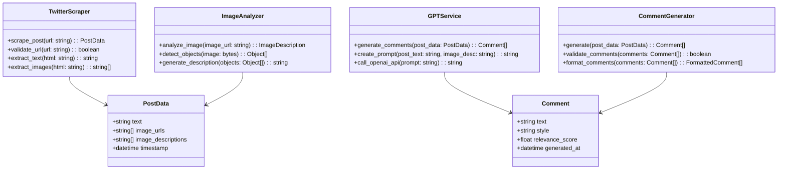

# Архітектурні схеми та діаграми

## 1. Діаграма компонентів системи

## 2. Послідовність обробки запиту

## 3. Структура бази даних

## 4. Діаграма класів Backend

## 5. Діаграма станів запиту

## 6. Діаграма розгортання

## 7. Діаграма безпеки

## 8. Моніторинг та логування

## 9. Діаграма тестування

## 10. Діаграма CI/CD Pipeline

## 11. Діаграма масштабування

## 12. Діаграма відмовостійкості

## 13. Діаграма конфігурації

## 14. Діаграма інтеграції зовнішніх сервісів

## 15. Діаграма користувацького інтерфейсу

